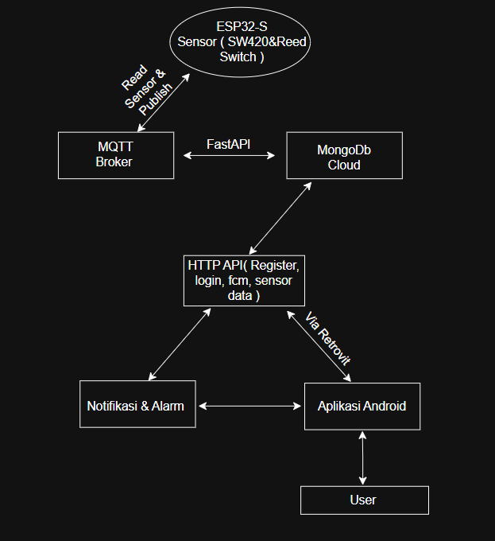

# IoT-Based Smart Vehicle Security System

## Description
*This project develops a smart vehicle security system based on the Internet of Things (IoT). The system is designed to detect suspicious activity such as vibrations or opening vehicle seats using SW-420 sensors and reed switches connected to an ESP32 microcontroller.
When a potential intrusion is detected, the system sends an alert via notification to the user's Android app, which can trigger an automatic alarm.

*The system's backend is built using FastAPI and connects to MongoDB Atlas to store real-time sensor detection data. Communication between the device and the server uses the MQTT protocol through an EMQX broker.

Furthermore, Firebase Cloud Messaging is used to send notifications directly to Android devices. The Android app is developed using Java, with an interactive interface that includes login features, security mode settings, and alarm control.

*This project consists of three main components: the ESP32 code in PlatformIO, the FastAPI backend, and the Android app. Each component integrates to create a connected, responsive, and remotely controllable vehicle security system.

## Technology
- ESP32 (PlatformIO)
- FastAPI (Backend)
- MongoDB Atlas
- MQTT Broker (EMQX)
- Firebase Cloud Messaging
- Android Studio

## Note
*Secret files such as `.env`, `serviceAccountKey.json`, and `google-services.json` are not included for security reasons.

## Flowchart System

